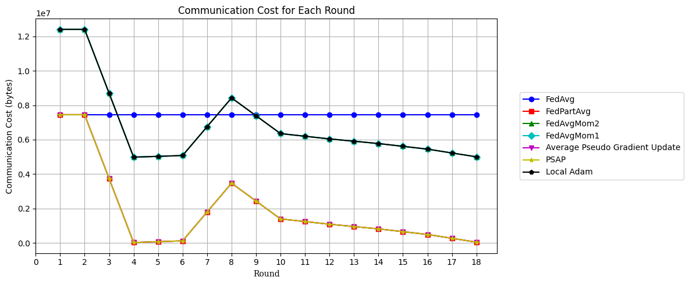

# L46 Project - An Analysis of Layer-wise learning strategies in Federated Learning Using Momentum and Cosine Similarity Based Weightings


#  Declaration

This project was built on top of the [project](https://github.com/ViragSimon/L361_Project) submitted for L361 Federetard Learning course (report included in the files) and serves as an extension of it with approval of the programme coordinator. The FedAvg based strategies' results of the original project are reproduced and used with the same model and settings to serve as a baseline and comparison. Therefore the developed layer-wise momentum strategy and the simple layer-wise strategies regarding FedAvg are re-used as a base implementation and extended in this project with the same data-heterogenity and client-dropout functions for easier comparison to the original project. 

# Introduction

The aim of this project is to further understand the limitations of layer-wise training strategies in federated learning based on the FedPart strategy proposed by Wang et al. ([2024](https://arxiv.org/abs/2410.11559)) .  In the original project implementation (L361 Project) we developed a new method to use both first and second momentum during the parameter aggregation from clients in order to improve the convergence speed of the training process while decreasing the total communication cost.  In the original implementation we used the cosine similarity of the first and second momentum compared to the central aggregated momentum of the previous (layer-wise) round. However, that implementation and project suffered from the following issues:

- Our cosine similarity based weighting only used the average of similarity values to decide their proportional weight. However, since cosine similarities can be negative, particularly for the first momentum, the weights can flip vectors rather than averaging them as well as the sums can result in zero. Hence we need to provide a weighting mechanism that maps the similarity values to a range between 0 and 1.


- We only explored the idea of using both first and second momentum in the original implementation and did not explore the idea of using only the first momentum. Since the second momentum tracks magnitude rather than direction, it results in weighting client more favourably based on their magnitude of change rather than their direction. Hence we need to explore the idea of using only the first momentum to see if it can provide a better performance.


- We did not present a direct comparison with one of the main source of inspiration for the original cosine similarity based weighting implementation, [Local-Adam](https://arxiv.org/abs/2409.13155), in a layer-wise training strategy setting.

- We did not explore the idea of using pseudo-gradient based updates to provide a cheaper (communication cost) alternative to the momentum based strategies.

Building upon the lessons learned this project aims to fix some of the issues of the original algorithm with extended 

Regarding cosine similarity based weighting this project presents 5 alternative approaches to the one shown in the original implementation:
- Softmax: Uses softmax weighting to map the similarity values to a range between 0 and 1.
- Sigmoid: Uses a sigmoid function to map the similarity values to a range between 0 and 1.
- Normalized sigmoid: Uses a normalized sigmoid that binds the values strictly to [0,1] range since -1 and 1 cosine similarity values do not map to a 0 and 1 in regular sigmoid function rather than to a smaller float value. Hence we normalize these values to get a range where -1 and 1 map to 0 and 1 respectively.
- Linear scoring: Uses a linear scoring function to map the similarity values to a range between 0 and 1.
- Absolute value: Uses the absolute value of the similarity values to map them between 0 and 1.

Furthermore, this project also presents a new novel approach to the cosine similarity based weighting by using the pseudo-gradient of the model parameters as a weighting factor. This approach is more computationally efficient and can be used to provide a cheaper alternative to the momentum based strategies. Additionally, this project also implements Local-Adam in a layer-wise training strategy to compare to our momentum based strategies. Finally, this project explores the use of the first momentum only as weighting factor in a layer-wise training strategy to compare to our both momentum using strategies. 

With these extensions we hope to gain a better understanding of the limitations of the layer-wise training strategies and the potential of the cosine similarity based weighting to improve the performance of federated communication reduced training processes. This project solely focuses on the FedAvg based methods and their performance unlike the original project which mainly explored the FedProx based strategies.


# Environment Setup


```
conda create -n fedpart python=3.12.2
```
```
conda activate fedpart
```
```
pip install -r requirements.txt
```

# Experimental Setup

In our experiments we used the flower framework to simulate clients and a server on an M2 Macbook Pro. We used the CIFAR-10 dataset with 6 client and simple model architecture (same used in the original project) that can be seen in ``src/model.py``. We split the training to 18 rounds where the first 2 rounds are used as full network training (warm up rounds) and the rest are used for layer-wise training. Specific parameters regarding the training can be seen in ``src/model.py`` and ``src/dataset.py``.


#  Results Summary

The results across the three experiment settings show that though the momentum based approaches posed as a promising solution to the layer-wise training strategies, they are not able to perform well compared to FedAvg and FedPartAvg due to their sensitivity of conflicting client optimiser states. This is especially became visible in the data heterogenity and client dropout experiments where the momentum based strategies performed worst compared to the FedAvg and FedPartAvg and Pseudo-gradient based strategies. However, it is important to mention that using cosine similarity based weighting can improve the performance of the momentum based strategies compared to simple momentum averaging based strategies like Local-Adam as the cosine similarity weight can act as a correcting mechanism for client deviation from the central model at the cost of larger fluctuations in the loss and accuracy measures across rounds. Unfortunately, none of the weighting mechanism distinguished themselves from the others in terms of performance for the momentum based strategies suggesting that the cosine similarity based weighting is not a silver bullet for the momentum based layer-wise training strategies. Furthermore, one of the potential issues that might contribute to the poor performance of the momentum based strategies is the small number of warm up rounds used in the experiments. Using only 2 warmup rounds might not provide enough information to capture a central parameter/direction tendency as it was shown on the parameter difference and cosine similarity plots that in early rounds there are great differences across client models which than later converge to a more similar state.

Another important observation is that the pseudo-gradient based strategies are able to perform better than their momentum based counterparts in terms of accuracy and loss. They are also effected by the fluctuation caused by the sensitivity of client dropout and data heterogenity but less so than the momentum based strategies. They also have significantly less communication cost compared to the momentum based strategies or FedAvg. Furthermore, the pseudo-gradient similarity based strategies are able to perform better than the average pseudo-gradient update based strategy showing that the cosine similarity based weighting is a promising approach to improve performance. Across all experiments the pseudo-gradient similarity based strategies are able to perform closely (or slightly better) than the FedAvg strategy with a fraction of communication cost. Although similarly to the momentum based strategies there is not any one weighting mechanism that distinguishes itself from the others in terms of performance.


## Accuracy

### Best Performance Strategies (and their variants) in Ideal Setup (All clients available and IID data distribution)
See Experiment 1 for more details.


### Best Performance Strategies (and their variants) in Data Heterogenity (Non-IID data distribution)
See Experiment 2 for more details.


### Best Performance Strategies (and their variants) in Client Dropout (50% client dropout)

See Experiment 3 for more details.


## Communication Cost





# Conclusion

Although the momentum based approach of the original work seemed to be promising, it could not fulfill its promises due to its sensitivity to client-dropout and data-heterogenity regardless of the weighting mechanism used. For momentum based strategies to be effective there needs to be a more adaptive weighting and aggregation mechanism in place as well as potentially more warm up rounds before layer-wise training to avoid the issues of early client dissimilarities and the resulting large parameter and cosine similarity differences.

On the other hand, the idea of using cosine similarity in layer-wise training still showed itself to be a promising and useful approach especially when combined with pseudo-gradient based update. Our various pseudo-gradient cosine similarity based approaches presented themselves to be more resilient to the issues of client-dropout and data-heterogenity making them competitive strategies against FedAvg in communication constrained environments.


# Future work

Although FedProx based strategies have been implemented, due to time limitation they could not be tested thoroughly hence they are not included in the results and the report. FedProx based strategies could potentially perform better due to the explicit limit in terms of deviation from the central model parameters as they did in the original work

Future work should focus on the analysis of the adaptation of different server-side strategies to FedPart layer-wise training strategy as well as focus on more adaptive weighting mechanism to improve the performance of the strategies.


# References


[Cheng, Z., & Glasgow, M. (2025). *Convergence of Distributed Adaptive Optimization with Local Updates*. arXiv:2409.13155.](https://arxiv.org/abs/2409.13155)

[Wang, H., Liu, X., Niu, J., Guo, W., & Tang, S. (2024). *Why Go Full? Elevating Federated Learning Through Partial Network Updates*. arXiv:2410.11559.](https://arxiv.org/abs/2410.11559)